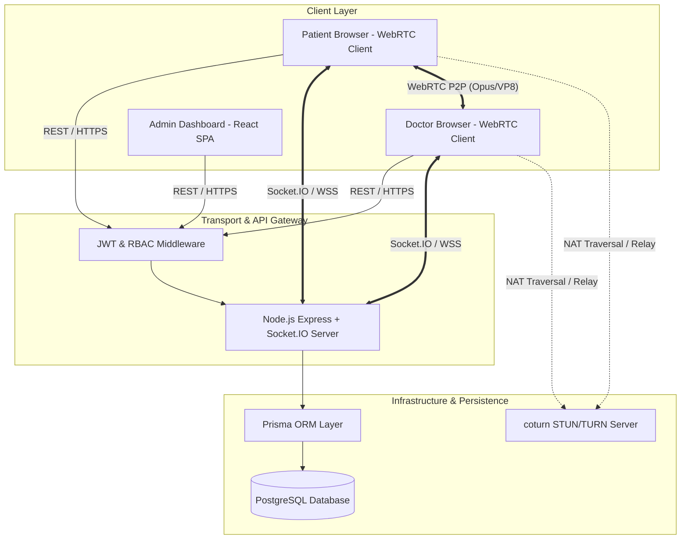
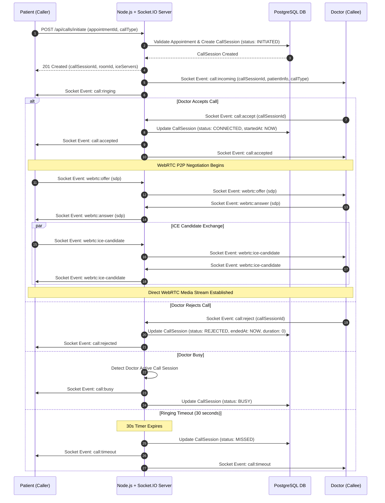
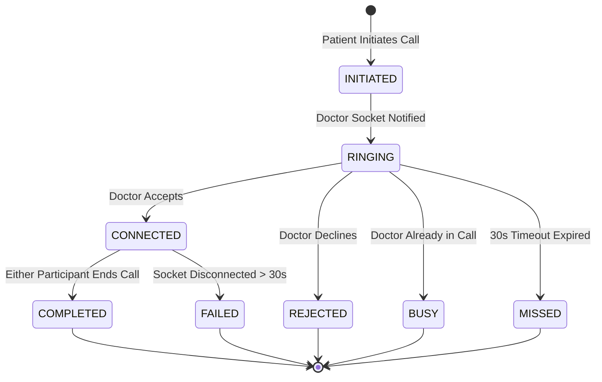

# Architecture & System Design Document

## 1. System Architecture Diagram

The NeerajPharma platform employs a decoupled client-server architecture consisting of a React Vite SPA, a Node.js Express backend with Socket.IO, a coturn TURN/STUN server for NAT traversal, and a PostgreSQL database.

---

## 2. WebRTC Peer Connection & Signaling Sequence Flow

The following sequence diagram details the exact signaling flow over Socket.IO required to establish a peer-to-peer WebRTC audio/video connection between Patient and Doctor.

---

## 3. Call Session State Machine

Every call session follows a strict finite state machine (FSM) managed by the backend:

---

## 4. Network Topology & TURN Server Traversal

1. **Direct P2P Stream**: When both participants are on open public networks or standard home routers, WebRTC establishes direct UDP communication using STUN for public IP discovery.
2. **Relayed Stream via coturn**: When one or both participants are behind restrictive symmetric NATs or corporate enterprise firewalls, WebRTC falls back to relaying encrypted media packets through the coturn TURN server over port 3478/443.
